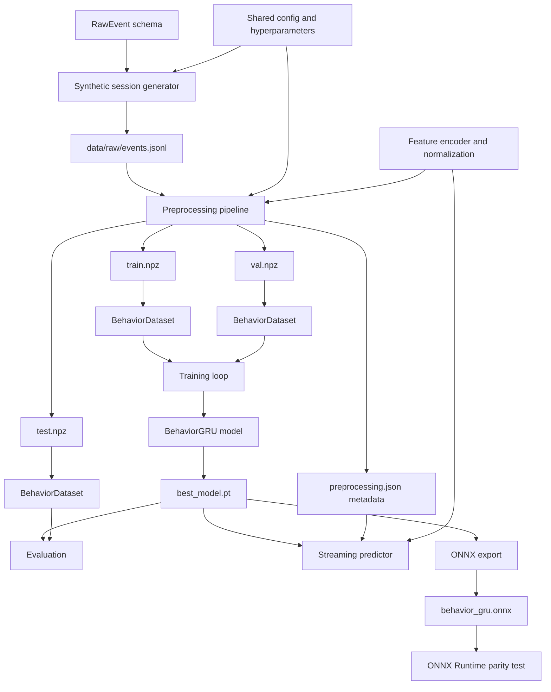
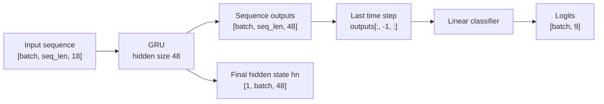
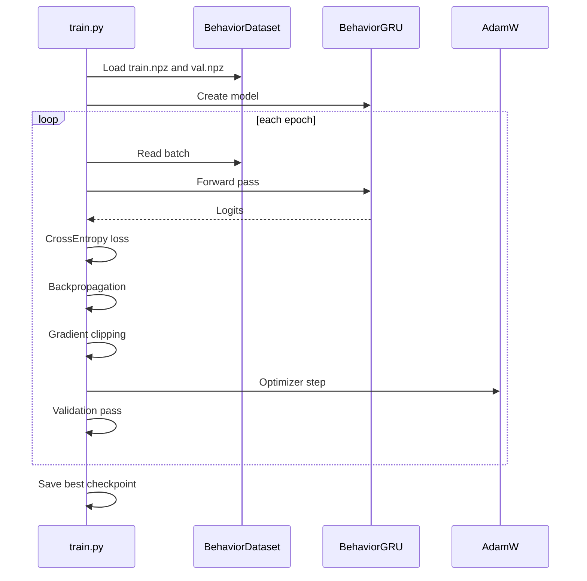
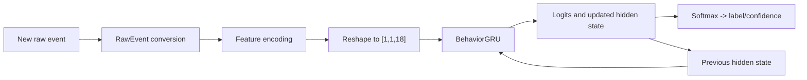

# Architecture

This document explains the implemented architecture of the user behavior tracker codebase.

## System Summary

The system learns user behavior patterns from event streams and predicts a behavior class using a GRU model.

It has two major operating modes:

- Training mode: the model learns from fixed-length event sequences.
- Streaming inference mode: the model receives one event at a time and carries forward the GRU hidden state.

## High-Level Architecture



## Source Modules

### 1. Configuration Layer

File: [src/config.py](/Users/dhanesh/Desktop/p/user-behavior-tracker/src/config.py)

This file defines the foundation of the whole system:

- project paths
- data file locations
- checkpoint and ONNX file locations
- sequence length
- batch size
- learning rate
- GRU hidden size
- event type vocabulary
- label vocabulary
- feature names
- normalization limits

Important constants:

- `SEQ_LEN = 50`
- `FEATURE_DIM = 18`
- `HIDDEN_SIZE = 48`
- `NUM_CLASSES = 9`
- `SESSION_IDLE_RESET_MS = 30000`

This module is shared by data generation, preprocessing, training, inference, and export.

### 2. Event Schema Layer

File: [src/schemas.py](/Users/dhanesh/Desktop/p/user-behavior-tracker/src/schemas.py)

This file contains the `RawEvent` dataclass.

Purpose:

- define a consistent raw event structure
- convert raw dictionaries into typed event objects
- convert typed events back into dictionaries for JSON writing

Main fields include:

- `session_id`
- `timestamp_ms`
- `event_type`
- `x`, `y`
- `delta_y`
- `velocity`
- `acceleration`
- `direction`
- `pressure`
- `duration_ms`
- `dwell_before_ms`
- `selection_word_count`
- `label`

### 3. Feature Engineering Layer

File: [src/features.py](/Users/dhanesh/Desktop/p/user-behavior-tracker/src/features.py)

This module converts raw events into model-ready numeric vectors.

#### Feature design

Each event becomes one fixed-size feature vector with:

- 7 one-hot event-type features
- 11 continuous normalized features

Total:

- `FEATURE_DIM = 18`

#### Event-type encoding

The event type is one-hot encoded instead of using a single integer id.

Why:

- avoids false numeric ordering like `click > scroll`
- gives the GRU a cleaner categorical representation

#### Normalized continuous features

The encoder adds:

- `velocity_norm`
- `acceleration_norm`
- `direction_norm`
- `delta_y_norm`
- `x_norm`
- `y_norm`
- `pressure_norm`
- `duration_norm`
- `dwell_before_norm`
- `selection_word_count_norm`
- `time_delta_norm`

#### Sequence shaping

This module also provides `pad_or_truncate()` which forces every training sample to become exactly:

```text
[SEQ_LEN, FEATURE_DIM] = [50, 18]
```

#### Metadata generation

It also builds the preprocessing metadata file so runtime inference can reuse the same:

- feature order
- label mapping
- event types
- normalization settings
- idle reset threshold

### 4. Synthetic Data Generation Layer

File: [src/generate_dummy_data.py](/Users/dhanesh/Desktop/p/user-behavior-tracker/src/generate_dummy_data.py)

This module creates learnable synthetic behavior data.

It writes:

- [data/raw/events.jsonl](/Users/dhanesh/Desktop/p/user-behavior-tracker/data/raw/events.jsonl)

#### Why synthetic data exists

The project needs a working training pipeline before real telemetry is available.

This generator does not produce fully random events. It creates behavior-specific patterns so the classifier can learn meaningful differences.

#### Behavior patterns

- `skimming`: fast, frequent scrolling with short delays
- `hunting`: more deliberate scroll, click, selection, and navigation combinations
- `normal`: balanced interaction pattern
- `ignore`: more idle time and lower interaction density
- `frustrated`: erratic scrolling, stronger touch pressure, more reversals, more error-like events
- `engaged`: active, varied, and purposeful interaction with low idle time
- `confused`: hesitant navigation, retries, pauses, and occasional error-like behavior
- `comparing`: repeated back-and-forth scrolling, revisits, and deliberate comparisons
- `deep_reading`: slower movement, longer dwell/selection activity, and fewer abrupt actions

#### Internal design

The module builds sessions by:

1. choosing a target behavior label
2. generating 40 to 90 events per session
3. spacing timestamps according to the behavior
4. sampling behavior-specific event types
5. adding small noise to avoid overly perfect synthetic examples

### 5. Preprocessing Layer

File: [src/preprocess.py](/Users/dhanesh/Desktop/p/user-behavior-tracker/src/preprocess.py)

This is the bridge between raw events and model inputs.

#### Responsibilities

- read JSONL raw events
- group events by `session_id`
- sort events by timestamp
- convert each event to a feature vector
- generate training windows from each session
- split sessions into train, validation, and test groups
- save processed arrays to `.npz`
- save preprocessing metadata to JSON

#### Session split strategy

The code splits by session id, not by individual event.

Why:

- avoids leakage between train and validation/test
- keeps events from one session in only one split

#### Window generation strategy

For each session, the code creates multiple prefix windows.

Example:

- if a session contains many events, it does not only use the final 50
- it also creates intermediate windows using `WINDOW_STRIDE`

This increases training examples and helps the model learn earlier-session signals.

#### Output files

- [data/processed/train.npz](/Users/dhanesh/Desktop/p/user-behavior-tracker/data/processed/train.npz)
- [data/processed/val.npz](/Users/dhanesh/Desktop/p/user-behavior-tracker/data/processed/val.npz)
- [data/processed/test.npz](/Users/dhanesh/Desktop/p/user-behavior-tracker/data/processed/test.npz)
- [outputs/metadata/preprocessing.json](/Users/dhanesh/Desktop/p/user-behavior-tracker/outputs/metadata/preprocessing.json)

## Model Architecture

File: [src/model.py](/Users/dhanesh/Desktop/p/user-behavior-tracker/src/model.py)



### Components

- `nn.GRU`
- one recurrent layer
- `batch_first=True`
- `nn.Linear(hidden_size, num_classes)`

### Forward pass

The forward method returns:

- `logits`
- `hn`

This is critical.

Why:

- `logits` are used for classification
- `hn` is reused during streaming inference

### ONNX wrapper

The file also contains `BehaviorGRUONNXWrapper`.

Purpose:

- expose the model to ONNX export with explicit `x` and `h0`
- make hidden-state based export cleaner

## Training Architecture

File: [src/train.py](/Users/dhanesh/Desktop/p/user-behavior-tracker/src/train.py)

### Training flow



### Key training components

- deterministic seed setup
- `BehaviorDataset` + `DataLoader`
- `CrossEntropyLoss`
- `AdamW`
- gradient clipping with `max_norm=1.0`
- best-checkpoint selection by validation accuracy

### Checkpoint contents

The saved checkpoint stores:

- model weights
- feature dimension
- hidden size
- number of classes
- best validation accuracy
- metadata file path

File:

- [outputs/checkpoints/best_model.pt](/Users/dhanesh/Desktop/p/user-behavior-tracker/outputs/checkpoints/best_model.pt)

## Evaluation Architecture

File: [src/evaluate.py](/Users/dhanesh/Desktop/p/user-behavior-tracker/src/evaluate.py)

This module:

- loads the saved checkpoint
- reconstructs the GRU model
- runs predictions on the test split
- computes classification report metrics
- computes the confusion matrix

This is the offline quality-check stage for the trained checkpoint.

## Streaming Inference Architecture

File: [src/stream_inference.py](/Users/dhanesh/Desktop/p/user-behavior-tracker/src/stream_inference.py)

This module implements real-time prediction with persistent recurrent state.

### Streaming design



### Runtime state

`StreamBehaviorPredictor` keeps:

- loaded metadata
- loaded checkpoint/model
- `hidden`
- `last_timestamp_ms`
- idle reset threshold

### Idle reset rule

If the new event arrives after a long inactivity gap, the predictor resets its hidden state.

Why:

- avoids leaking one session’s context into a new interaction period

### Output

Each call returns:

- predicted label
- confidence
- per-class score map

## ONNX Export Architecture

File: [src/export_onnx.py](/Users/dhanesh/Desktop/p/user-behavior-tracker/src/export_onnx.py)

This module exports the PyTorch model to ONNX.

### Export inputs

- `input`: sequence tensor
- `h0`: initial hidden state tensor

### Export outputs

- `logits`
- `hn`

### Why hidden state is exported

Because the streaming design depends on recurrent state continuity.

If `h0` and `hn` are explicit ONNX inputs/outputs, external clients such as mobile apps can carry hidden state between events.

### Export note

The code uses:

- `dynamo=False`

This forces the legacy exporter path because the installed environment did not include the newer exporter dependency chain.

## ONNX Validation Architecture

File: [src/test_onnx.py](/Users/dhanesh/Desktop/p/user-behavior-tracker/src/test_onnx.py)

This module verifies numerical agreement between:

- PyTorch
- ONNX Runtime

### It checks two cases

1. full sequence inference
2. one-step streaming inference with carried hidden state

### Validation logic

For both systems, the code:

- runs the same inputs
- compares logits
- compares hidden states
- fails if the max absolute difference exceeds a tolerance

This is important because export success alone does not guarantee runtime parity.

## Data And Control Flow In Practice

### Offline training path

```text
generate_dummy_data.py
-> events.jsonl
-> preprocess.py
-> train.npz / val.npz / test.npz
-> train.py
-> best_model.pt
-> evaluate.py
```

### Streaming inference path

```text
raw event
-> RawEvent
-> event_to_feature_vector()
-> tensor [1, 1, 18]
-> BehaviorGRU(x, hidden)
-> logits + new hidden
-> predicted behavior
```

### Deployment path

```text
best_model.pt
-> export_onnx.py
-> behavior_gru.onnx
-> ONNX Runtime client
```

## Important Design Decisions

### 1. One-hot event types instead of integer ids

This avoids accidental ordinal meaning in event categories.

### 2. Fixed training windows plus streaming runtime

Training uses stable fixed-size tensors.

Inference uses:

- one event at a time
- explicit hidden-state carryover

This gives a practical combination of simple training and real-time deployment.

### 3. Shared preprocessing metadata

The runtime predictor depends on the same feature order and normalization used during training.

That is why metadata is saved explicitly instead of being implicit in code alone.

### 4. Session-level labels in the current design

Each generated session currently has one dominant behavior label.

This is suitable for the current synthetic baseline, but future real-world datasets may need:

- segment-level labels
- timestamp-level labels
- behavior transitions within the same session

## Current Artifacts Produced By The System

- [data/raw/events.jsonl](/Users/dhanesh/Desktop/p/user-behavior-tracker/data/raw/events.jsonl)
- [data/processed/train.npz](/Users/dhanesh/Desktop/p/user-behavior-tracker/data/processed/train.npz)
- [data/processed/val.npz](/Users/dhanesh/Desktop/p/user-behavior-tracker/data/processed/val.npz)
- [data/processed/test.npz](/Users/dhanesh/Desktop/p/user-behavior-tracker/data/processed/test.npz)
- [outputs/metadata/preprocessing.json](/Users/dhanesh/Desktop/p/user-behavior-tracker/outputs/metadata/preprocessing.json)
- [outputs/checkpoints/best_model.pt](/Users/dhanesh/Desktop/p/user-behavior-tracker/outputs/checkpoints/best_model.pt)
- [outputs/onnx/behavior_gru.onnx](/Users/dhanesh/Desktop/p/user-behavior-tracker/outputs/onnx/behavior_gru.onnx)

## Recommended Reading Order

If you want to understand the code quickly, read in this order:

1. [src/config.py](/Users/dhanesh/Desktop/p/user-behavior-tracker/src/config.py)
2. [src/schemas.py](/Users/dhanesh/Desktop/p/user-behavior-tracker/src/schemas.py)
3. [src/features.py](/Users/dhanesh/Desktop/p/user-behavior-tracker/src/features.py)
4. [src/generate_dummy_data.py](/Users/dhanesh/Desktop/p/user-behavior-tracker/src/generate_dummy_data.py)
5. [src/preprocess.py](/Users/dhanesh/Desktop/p/user-behavior-tracker/src/preprocess.py)
6. [src/model.py](/Users/dhanesh/Desktop/p/user-behavior-tracker/src/model.py)
7. [src/train.py](/Users/dhanesh/Desktop/p/user-behavior-tracker/src/train.py)
8. [src/stream_inference.py](/Users/dhanesh/Desktop/p/user-behavior-tracker/src/stream_inference.py)
9. [src/export_onnx.py](/Users/dhanesh/Desktop/p/user-behavior-tracker/src/export_onnx.py)
10. [src/test_onnx.py](/Users/dhanesh/Desktop/p/user-behavior-tracker/src/test_onnx.py)
